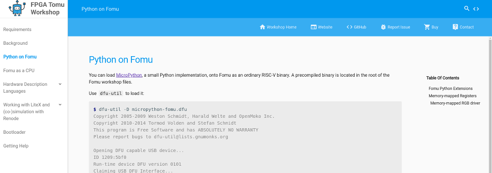

# SymbiFlow's Sphinx Theme (Based on Material Design).

This repository contains the [Sphinx](https://www.sphinx-doc.org/en/master/)
 theme used
[by SymbiFlow](https://symbiflow.github.io)
on all its generated documentation
([including the theme's own!](https://sphinx-symbiflow-theme.readthedocs.io/en/latest/)).

You can find examples at;
 * https://symbiflow.rtfd.io
 * https://prjxray.rtfd.io
 * https://skywater-pdk.rtfd.io
 * https://workshop.fomu.im

The Sphinx Symbiflow Theme is based on the
[Sphinx Material Design Theme](http://github.com/myyasuda/sphinx_materialdesign_theme).

## Screenshots




## Requirements

- python
  - Sphinx

## Quick Start

Install the `sphinx_symbiflow_theme`:

```shell
python3 setup.py install
```

Add the following line to `conf.py`.

```python
html_theme = 'sphinx_symbiflow_theme'
```

## Html theme options

The following is a description of the options that can be specified in `html_theme_options` in your project's `conf.py`.

```python
html_theme_options = {
    # Specify a list of menu in Header.
    # Tuples forms:
    #  ('Name', 'external url or path of pages in the document', boolean, 'icon name')
    #
    # Third argument:
    # True indicates an external link.
    # False indicates path of pages in the document.
    #
    # Fourth argument:
    # Specify the icon name.
    # For details see link.
    # https://material.io/icons/
    'header_links' : [
        ('Home', 'index', False, 'home'),
        ("ExternalLink", "http://example.com", True, 'launch'),
        ("NoIconLink", "http://example.com", True, ''),
        ("GitHub", "https://github.com/SymbiFlow/sphinx_symbiflow_theme", True, 'link')
    ],

    # Customize css colors.
    # For details see link.
    # https://getmdl.io/customize/index.html
    #
    # Values: amber, blue, brown, cyan deep_orange, deep_purple, green, grey, indigo, light_blue,
    #         light_green, lime, orange, pink, purple, red, teal, yellow(Default: indigo)
    'primary_color': 'indigo',
    # Values: Same as primary_color. (Default: pink)
    'accent_color': 'pink',

    # Customize layout.
    # For details see link.
    # https://getmdl.io/components/index.html#layout-section
    'fixed_drawer': True,
    'fixed_header': True,
    'header_waterfall': True,
    'header_scroll': False,

    # Render title in header.
    # Values: True, False (Default: False)
    'show_header_title': False,
    # Render title in drawer.
    # Values: True, False (Default: True)
    'show_drawer_title': True,
    # Render footer.
    # Values: True, False (Default: True)
    'show_footer': True
}
```

## Developer's Tips

### Modifying the theme

* Initialize repository

```
make init
```

* Make changes of the theme in `src/` directory

* Build the theme

```
make
```
* Commit the changes

### Build Example's Document

```
sphinx-build -b html ./example ./_build -c ./example
```

## License

|thirdparty              |version  |license         |URL                                                                |
|-----------------------|---------|----------------|-------------------------------------------------------------------|
| Material Design Lite  |1.3.0    | Apache 2.0     |https://github.com/google/material-design-lite/blob/mdl-1.x/LICENSE|
| Material design icons |3.0.1    | Apache 2.0     |https://github.com/google/material-design-icons/blob/master/LICENSE|
